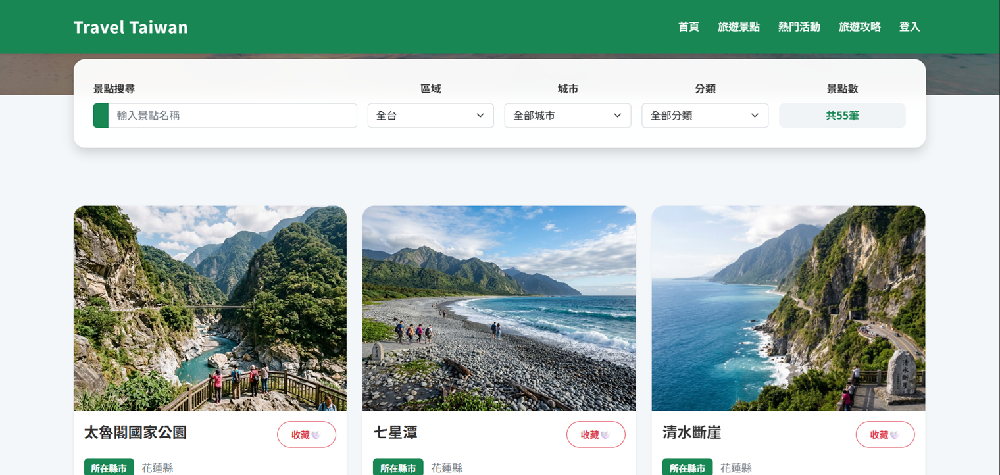
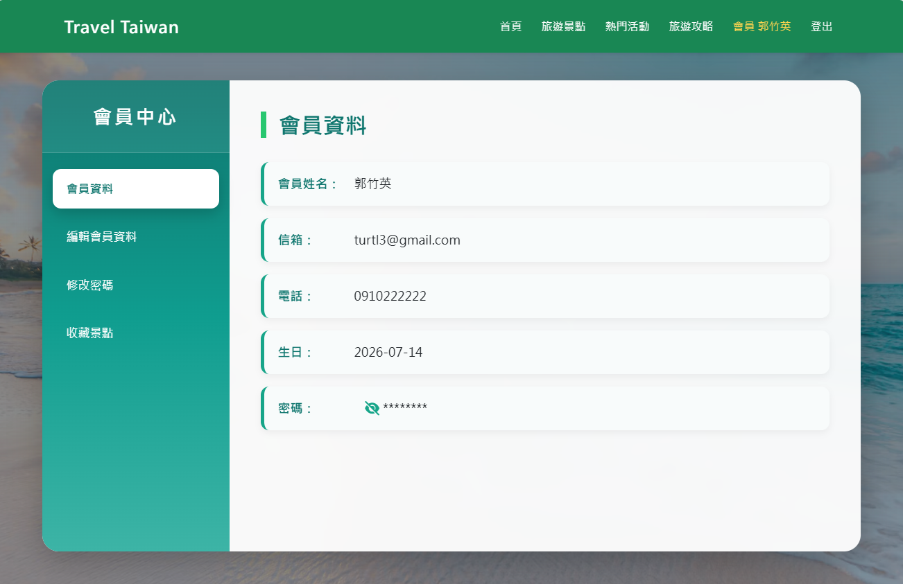
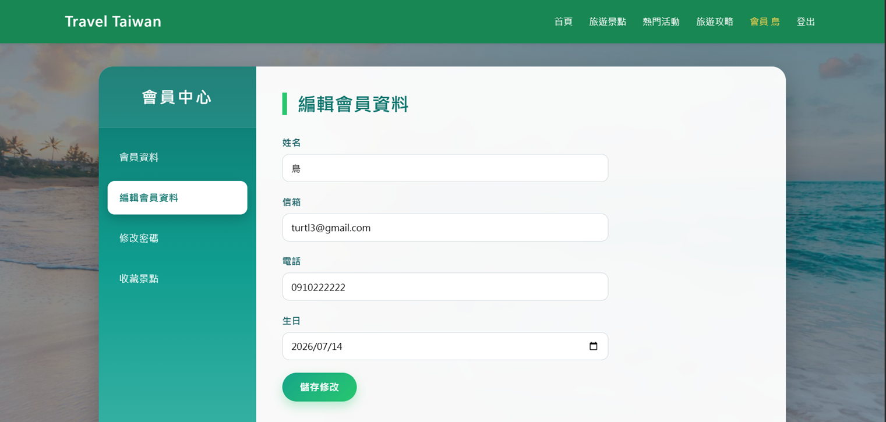
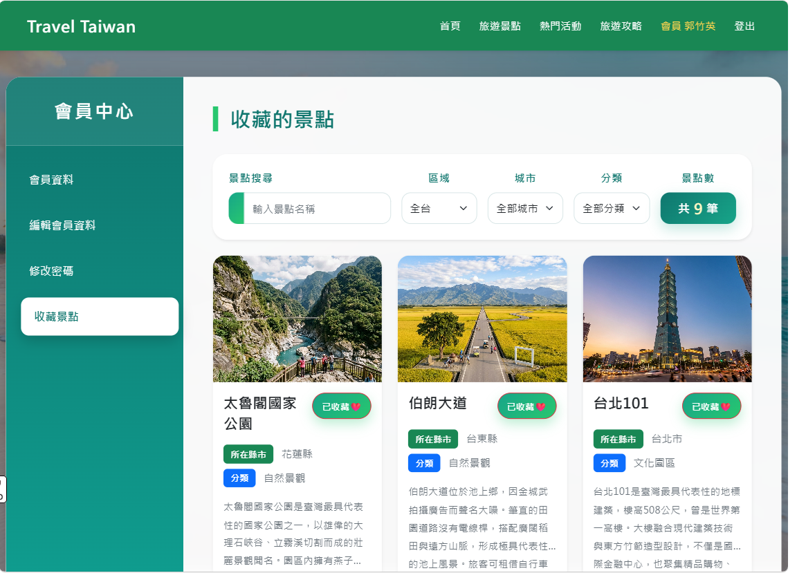
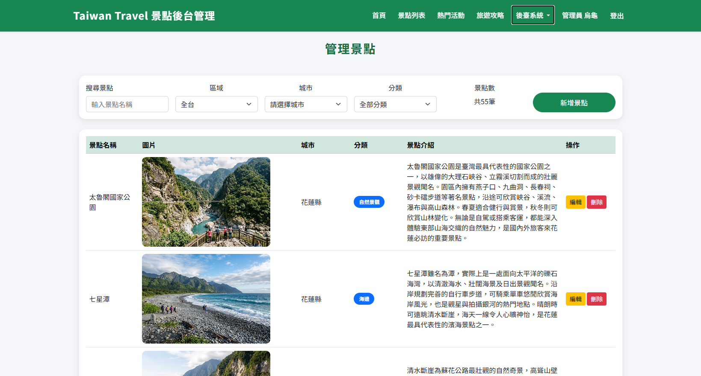
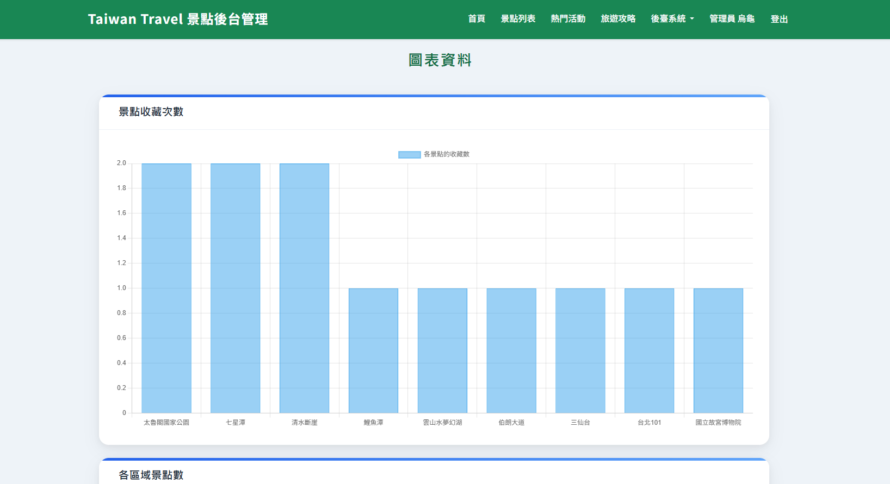
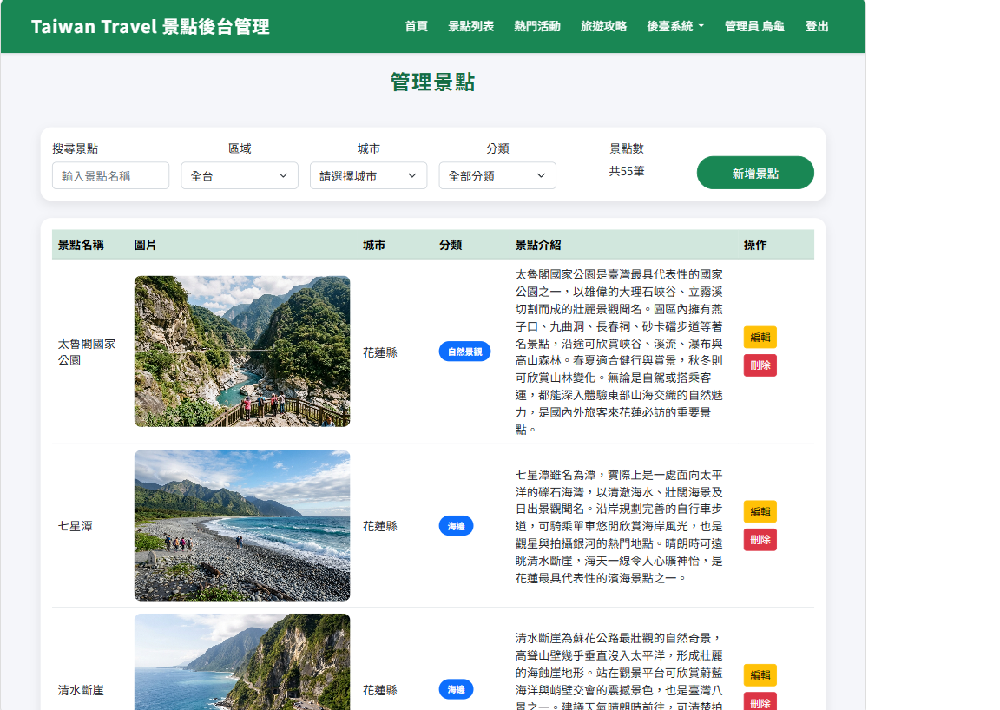
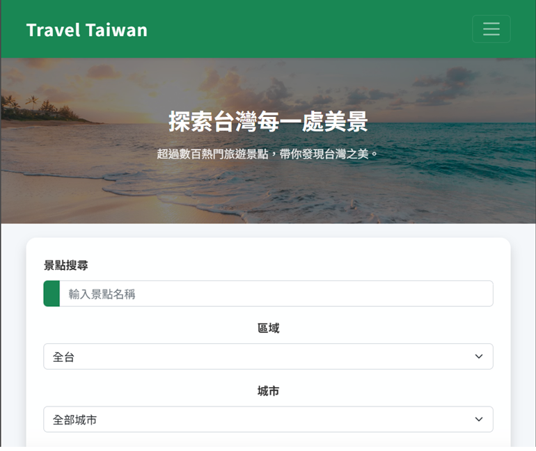
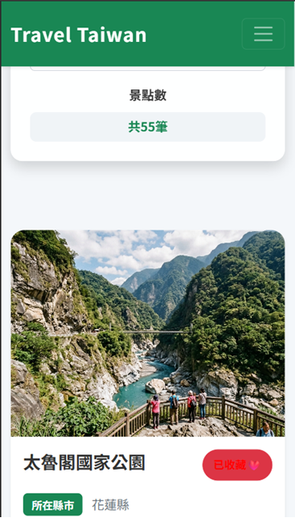

#AI Travel Guide Website

##專題簡介

本專題是一個「AI 輔助旅遊景點推薦平台」範例，使用 Bootstrap 製作 RWD 前端頁面，使用 jQuery 發送 Ajax 呼叫Laravel API  ，並以 MySQL 儲存景點與分類資料。

系統可以瀏覽景點、查詢景點、查看景點詳細內容、管理景點資料，並在管理頁顯示統計圖表。

## 使用技術

| 類別 | 技術 |
| --- | --- |
| 前端 | HTML、CSS、Bootstrap 5、jQuery、Vue.js 3 |
| 圖表 | Chart.js |
| 後端 | Laravel |
| 資料庫 | MySQL |
| 部署 | Render |
| 版本管理 | Git、GitHub |

## 系統功能說明

| 頁面或功能 | 說明 | 截圖位置 |
| --- | --- | --- |
| 首頁 | 顯示專題介紹、主要功能入口。 | `screenshots/home.png` |
| 景點列表 | 以卡片呈現景點資料，可使用關鍵字、城市、分類查詢，並支援分頁。 | `screenshots/attractions.png` |
| 會員系統 | 可註冊、登入、編輯會員資料、修改密碼、查看已收藏的景點。 | `screenshots/member.png` |
| 簡易管理功能 | 可新增、修改、刪除景點資料。 | `screenshots/admin.png` |
| 統計圖表 | 從後端 API 取得統計資料，使用 Chart.js 顯示各區域景點數量與各景點收藏數。 | `screenshots/charts.png` |

### 截圖說明

請將實際截圖放在 `screenshots/` 資料夾，建議檔名如下：

| 檔名 | 說明 |
| --- | --- |
| `home.png` | 首頁畫面 |
| `attractions.png` | 景點列表、搜尋、篩選、排序、分頁畫面 |
| `member.png` | 會員中心畫面 |
| `memberupdate.png` | 會員資料修改畫面 |
| `favorite.png` | 會員收藏景點畫面 |
| `admin.png` | 管理頁新增、修改、刪除畫面 |
| `charts.png` | 管理頁統計圖表畫面 |
| `rwd-1200.png` | 桌機寬度 1200px 檢查 |
| `rwd-768.png` | 平板寬度 768px 檢查 |
| `rwd-375.png` | 手機寬度 375px 檢查 |

### 專案畫面截圖

#### 首頁


#### 景點列表



#### 會員中心



#### 會員資料修改



#### 會員景點收藏



#### 管理頁



#### 統計圖表



### RWD 檢查截圖

#### 桌機寬度 1200px



#### 平板寬度 768px



#### 手機寬度 375px



## 資料庫設計說明

本專題使用 MySQL，資料庫檔案為 `itec`。程式啟動時會自動建立資料表與預設資料。

### attraction 景點資料表

| 欄位 | 型別 | 說明 |
| --- | --- | --- |
| id | INT | 主鍵，自動編號 |
| attName | CHAR | 景點名稱 |
| attArea | CHAR | 地區 |
| cityId | INT | 城市編號，對應 `city.id` |
| classId | INT | 分類編號，對應 `class.id` |
| attContent | VARCHAR | 景點介紹 |
| attImg | VARCHAR | 景點圖片 |
| created_at | timestamp | 建立時間 |

### city 景點資料表

| 欄位 | 型別 | 說明 |
| --- | --- | --- |
| id | INT | 主鍵，自動編號 |
| cityName | CHAR | 景點名稱 |
| created_at | timestamp | 建立時間 |

### class 類別資料表

| 欄位 | 型別 | 說明 |
| --- | --- | --- |
| id | INT | 主鍵，自動編號 |
| className | CHAR | 類別名稱 |
| created_at | timestamp | 建立時間 |

### member 會員資料表

| 欄位 | 型別 | 說明 |
| --- | --- | --- |
| id | INT | 主鍵，自動編號 |
| userName | VARCHAR | 會員名稱 |
| email | VARCHAR | 信箱 |
| phone | CHAR | 電話 |
| birthday | datetime | 生日 |
| pwd | VARCHAR | 密碼 |
| created_at | timestamp | 建立時間 |

### member_attraction 收藏資料表

| 欄位 | 型別 | 說明 |
| --- | --- | --- |
| id | INT | 主鍵，自動編號 |
| memberId | INT | 會員編號，對應 `member.id` |
| attractionId | INT | 景點編號，對應 `attraction.id` |

### 資料表關聯

### attraction 景點資料表

`attractions.cityId` 對應到 `city.id`，代表每一筆景點資料都有一個城市分類。
`attractions.classId` 對應到 `class.id`，代表每一筆景點資料都有一個類別分類。

### member_attraction 收藏資料表

`member_attraction.memberId` 對應到 `member.id`，代表每一筆收藏資料都有對應到一個會員。
`member_attraction.attractionId` 對應到 `attraction.id`，代表每一筆收藏資料都有對應到一個景點。

## API 說明

## API `/api.php`

| 方法 | 路徑 | 功能 | 前端使用位置 |
| --- | --- | --- | --- |
| GET | `/member/checkmail` | 檢查email | 會員編輯 |
| GET | `/member/checkpwd` | 檢查密碼 | 會員修改密碼 |
| GET | `/attracion/getAttractionList` | 查詢景點列表，支援搜尋、篩選、分頁 | 景點列表 |
| GET | `/attraction/favoriteAttractionList` | 查詢會員已收藏的景點，支援搜尋、篩選、分頁 | 會員收藏景點 |

## API `/admin/admin.php`

| 方法 | 路徑 | 功能 | 前端使用位置 |
| --- | --- | --- | --- |
| GET | `/admin/adminhome` | view管理景點列表頁面 | 管理景點 |
| GET | `/admin/creat` | view新增景點頁面 | 新增景點頁面 |
| POST | `/admin/store` | 新增的景點存到後端資料庫 | 新增景點頁面 |
| GET | `/admin/edit{id}` | view景點修改頁面 | 景點修改頁面 |
| DELETE | `/admin/delete` | 刪除景點 | 管理景點 |
| POST | `/admin/update` | 將修改的景點資料存到後端資料庫 | 景點修改頁面 |
| GET | `/admin/adminchat` | view後台數據圖表 | 景點收藏圖表 |

## API `/admin/attractions`

| 方法 | 路徑 | 功能 | 前端使用位置 |
| --- | --- | --- | --- |
| GET | `/attraction/home` | view景點首頁 | 景點首頁 |
| GET | `/attraction/list` | view景點列表頁面 | 旅遊景點 |
| POST | `/attraction/addfavorite` | 會員收藏功能 | 旅遊景點 |

## API `/admin/member`

| 方法 | 路徑 | 功能 | 前端使用位置 |
| --- | --- | --- | --- |
| GET | `/member/login` | view會員登入頁面 | 會員登入頁面 |
| POST | `/member/dologin` | 判斷會員登入帳密是否錯誤，並登入 | 會員登入首頁 |
| POST | `/member/logout` | 會員登出 | 導覽列登出 |
| GET | `/member/register` | view會員註冊頁面 | 會員註冊頁面 |
| POST | `/member/store` | 會員資料儲存 | 會員註冊頁面 |
| GET | `/member/home` | view會員中心 | 會員中心頁面 |
| POST | `/member/update` | 會員資料修改 | 會員中心頁面 |
| POST | `/member/updatepwd` | 會員密碼修改 | 會員中心頁面 |


## AI 功能說明

本專題名稱為 AI Travel Guide，AI 輔助功能主要用於產生景點介紹文字、旅遊推薦文案與後續行程規劃功能設計。

目前專案已完成景點資料管理、列表查詢與統計圖表。後續可以擴充，讓使用者輸入城市、天數、旅遊偏好後，自動產生推薦行程。

## 測試紀錄

<!-- | 日期 | 測試項目 | 測試方法 | 結果 |
| --- | --- | --- | --- |
| 2026-08-10 | 檢視路由 | Laravel:`php artisan route:cache` | Routes cached successfully. |
| 2026-08-10 | 檢視前端blade | Laravel:`php artisan view:cache` | Blade templates cached successfully. | -->

## 安裝與執行方式

1. Githut檔下載

```cmd
git clone https://github.com/d83080918/Travel_Taiwan
```

2. 安裝套件

```composer
composer install
```

3. 建立.env

```env
copy .env.example .env
```

4. 產生APP_KEY

```APP_KEY
php artisan key:generate
```

5. 啟動

```VS code
php artisan serve
```


6. 開啟網站

```text
http://127.0.0.1:8000
```

## 開發者資訊

| 項目 | 內容 |
| --- | --- |
| 開發者 | 黃登群 |
| 專案名稱 | AI Travel Guide Website |
| GitHub Repository | https://github.com/d83080918/Travel_Taiwan |